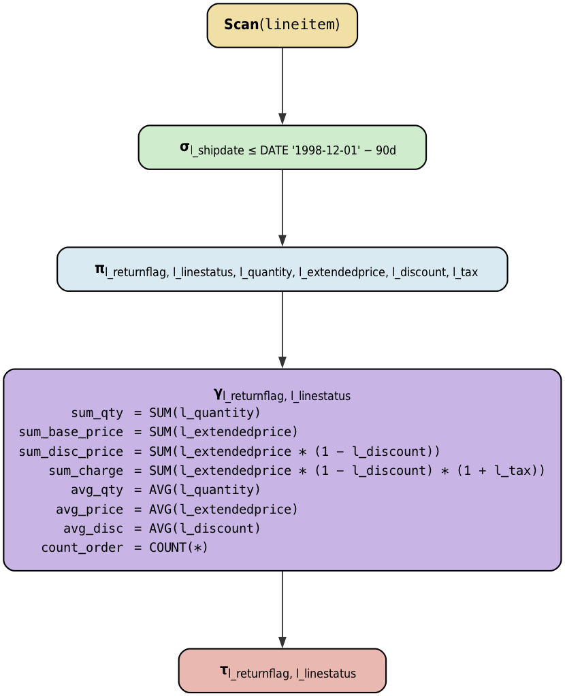

# TPC-H Query Plans - Relational Algebra Visualization

This repository contains relational algebra visualizations for selected TPC-H benchmark queries.

**Note:** Query plans flow from bottom to top - table scans are at the bottom, and final results are at the top.

## Query Plans

### TPC-H Q1: Pricing Summary Report Query


### TPC-H Q3: Shipping Priority Query


### TPC-H Q6: Forecasting Revenue Change Query


### TPC-H Q9: Product Type Profit Measure Query


### TPC-H Q13: Customer Distribution Query


## Relational Algebra Operators

- **σ** (Sigma) - Selection/Filter
- **π** (Pi) - Projection
- **⋈** (Bowtie) - Join
- **⟕** (Left Join) - Left Outer Join
- **γ** (Gamma) - Group/Aggregation
- **τ** (Tau) - Sort/Order By
- **ρ** (Rho) - Rename

## How to Generate Diagrams

All diagrams are generated from DOT files using Graphviz:

```bash
dot -Tpng "graph.dot" -o "graph.png"
dot -Tpng "TPC-H Q3.dot" -o "TPC-H Q3.png"
dot -Tpng "TPC-H Q6.dot" -o "TPC-H Q6.png"
dot -Tpng "TPC-H Q9.dot" -o "TPC-H Q9.png"
dot -Tpng "TPC-H Q13.dot" -o "TPC-H Q13.png"
```

## Requirements

- [Graphviz](https://graphviz.org/) - Graph visualization software

### Installation

macOS:
```bash
brew install graphviz
```

Ubuntu/Debian:
```bash
sudo apt-get install graphviz
```

## About TPC-H

The TPC-H benchmark is a decision support benchmark that consists of a suite of business-oriented ad-hoc queries and concurrent data modifications. These visualizations represent the logical query execution plans using standard relational algebra notation.
